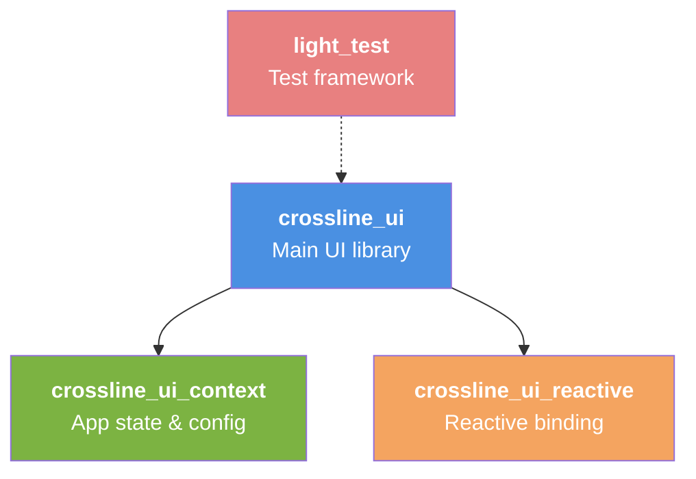
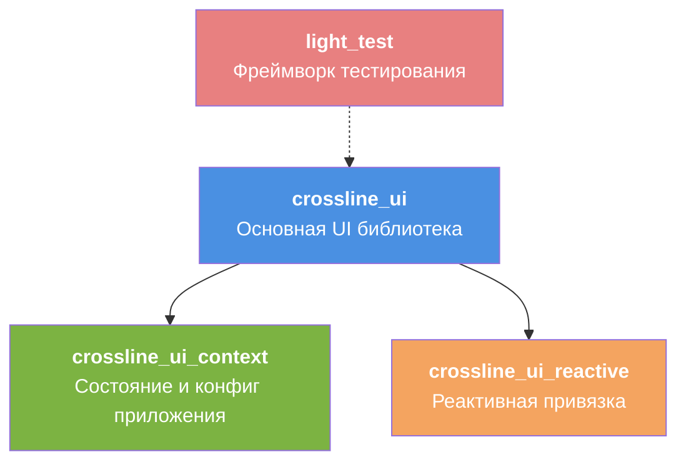

> English

# Crossline Architecture

## Overview

Crossline is architected as a modular C++23 application with a clear separation between the core UI framework, test infrastructure, and language-specific integrations. The entire codebase leverages modern C++ features including modules, concepts, and structured data flow.

## Module Hierarchy

### Core Modules



### Detailed Module Responsibilities

| Module | File(s) | Responsibility |
|--------|---------|-----------------|
| **crossline_ui** | `core/user-interface/modules/crossline_ui.cppm` | Main UI widget system, layout engine, event routing |
| **crossline_ui_reactive** | `core/user-interface/modules/crossline_ui_reactive.cppm` | Observable/observer pattern for state changes |
| **crossline_ui_context** | `core/user-interface/modules/crossline_ui_context.cppm` | Global application state, preferences, theme |
| **light_test** | `tests/light_test.cppm` | Cross-platform test harness and reporting |

## Design Patterns

### 1. Reactive Programming

The `crossline_ui_reactive` module implements a lightweight observer pattern:

```cpp
// Define reactive state
reactive<int> counter(0);

// Subscribe to changes
counter.add_subscriber([](const int& value) {
    std::cout << "Counter: " << value << '\n';
});

// Automatically notifies subscribers
counter.set(42);
```

**Benefits:**
- Decouples UI updates from business logic
- Zero-copy notifications (const ref)
- Automatic change propagation
- Works with any type (templates)

### 2. Concept-Based Type Safety

Using C++20 concepts to enforce contracts:

```cpp
// Only callable objects returning bool
template<class Func>
    requires std::is_invocable_r_v<bool, Func>
test_case(const std::string& name, Func&& f);
```

**Benefits:**
- Compile-time prevention of invalid types
- Clear intent in function signatures
- Excellent error messages
- Zero runtime overhead

### 3. Standard Expected for Error Handling

`std::expected<T, E>` replaces exceptions in performance-critical code:

```cpp
std::expected<bool, std::string> run() const noexcept {
    try { return invokable_(); }
    catch (const std::exception& e) {
        return std::unexpected(std::format("Error: {}", e.what()));
    }
}
```

**Benefits:**
- Explicit failure cases (no silent throws)
- Compilable with `-fno-exceptions`
- Efficient (no stack unwinding)
- Composable with `|` operator

### 4. Module-Based Organization

Unlike header-only or include-guard approaches:

```cpp
// crossline_ui.cppm
export module crossline_ui;

export class button { /* ... */ };
export class text_input { /* ... */ };

// main.cpp
import crossline_ui;  // Imports all exports
```

**Benefits:**
- Single compilation artifact per module
- No duplicate template instantiation
- Strong encapsulation (private not exposed)
- Faster builds overall

## Layer Architecture

```
┌─────────────────────────────────────────────────┐
│  Application Layer (main.cpp)                   │
│  - Entry point, window loop, event dispatch    │
└──────────────────┬──────────────────────────────┘
                   │
┌──────────────────▼──────────────────────────────┐
│  UI Framework Layer (crossline_ui)              │
│  - Widgets, layout, styling, event handling    │
└──────────────────┬──────────────────────────────┘
                   │
┌──────────────────▼──────────────────────────────┐
│  Reactive Layer (crossline_ui_reactive)         │
│  - Observable state, observers, bindings       │
└──────────────────┬──────────────────────────────┘
                   │
┌──────────────────▼──────────────────────────────┐
│  Context Layer (crossline_ui_context)           │
│  - Global state, preferences, configuration    │
└──────────────────┬──────────────────────────────┘
                   │
┌──────────────────▼──────────────────────────────┐
│  System Layer (OS/Graphics APIs)                │
│  - Windowing (GLFW), rendering, file I/O       │
└─────────────────────────────────────────────────┘
```

## Data Flow

### From User Input to Model Update

```
User presses key
    │
    ▼
Window event (GLFW callback)
    │
    ▼
Application event loop (main.cpp)
    │
    ▼
Event dispatcher (crossline_ui)
    │
    ▼
Widget receives event
    │
    ▼
Widget modifies reactive<T> state
    │
    ▼
Subscribers notified (crossline_ui_reactive)
    │
    ▼
UI layer redraws affected widgets
```

## Module Interface (C++23)

### Example: crossline_ui_reactive

**Public (Exported):**
```cpp
export class reactive<T> { /* ... */ };
export void register_tests();
```

**Private (Hidden by default):**
```cpp
namespace detail {
    class jsonify { /* ... */ };  // Internal JSON formatting
}
```

The module system ensures `detail::jsonify` cannot be accessed from outside the module, even though the source code is available.

## Testing Architecture

### light_test Framework

```
┌───────────────────────────────────────┐
│  test functions (return bool)         │
└──────────────┬────────────────────────┘
               │
┌──────────────▼────────────────────────┐
│  make_test_case (wraps function)      │
└──────────────┬────────────────────────┘
               │
┌──────────────▼────────────────────────┐
│  make_test (groups cases)             │
└──────────────┬────────────────────────┘
               │
┌──────────────▼────────────────────────┐
│  register_tests (adds to global)      │
└──────────────┬────────────────────────┘
               │
┌──────────────▼────────────────────────┐
│  run_all_tests_and_print() in main    │
│  → outputs JSON to stdout             │
└───────────────────────────────────────┘
```

### Test Isolation

Each test runs in isolation:
- No global state carries between tests
- Each test result includes error details
- Tests can be run individually or in suites

See [TESTING.md](/docs/TESTING.md) for detailed examples.

## Future Architecture (Post-MVP)

### Language Server Integration

```
┌─────────────────────────────────────────┐
│  IDE Application (Crossline)            │
└──────────────┬──────────────────────────┘
               │
┌──────────────▼──────────────────────────┐
│  lsp_client Module (future)             │
│  - JSON-RPC, protocol handling         │
└──────────────┬──────────────────────────┘
               │
         (stdio/socket)
               │
┌──────────────▼──────────────────────────┐
│  Language Server (pyright, clangd, etc) │
└─────────────────────────────────────────┘
```

### AI Model Integration

```
┌─────────────────────────────────────────┐
│  IDE Application (Crossline)            │
└──────────────┬──────────────────────────┘
               │
┌──────────────▼──────────────────────────┐
│  onnx_runtime Module (future)           │
│  - Model loading, inference            │
└──────────────┬──────────────────────────┘
               │
┌──────────────▼──────────────────────────┐
│  ONNX Model (Qwen 0.6B, etc)            │
└─────────────────────────────────────────┘
```

## Build System

### CMake Integration

- **Presets:** `default` (Debug), `release`, `ci`
- **Targets:**
  - `crossline` — main application
  - `tests` — test executable
  - `crossline-user-interface` — UI library
  
### Module Compilation

CMake handles C++ module dependencies automatically:

```cmake
target_sources(crossline PRIVATE
    FILE_SET cxx_modules TYPE CXX_MODULES FILES
    core/user-interface/modules/crossline_ui_reactive.cppm
    core/user-interface/modules/crossline_ui.cppm
)
```

No manual header searches or include paths required.

## Performance Considerations

1. **Zero-copy state changes:** `reactive<T>` notifies via `const T&`
2. **Minimal allocations:** Stack-preferred, pool allocators for large data
3. **Lazy evaluation:** Rendering deferred until actual display needed
4. **Direct rendering:** Custom UI layer bypasses web/GPU abstraction layers

## Security

- **No network access (MVP):** Crossline runs entirely locally
- **No code execution:** AI models run inference, not arbitrary Python/JS
- **No telemetry:** Zero external requests

---

> Russian

# Архитектура Crossline

## Обзор

Crossline разработана как модульное приложение на C++23 с чётким разделением между основным UI фреймворком, инфраструктурой тестирования и интеграциями для конкретных языков. Весь кодовый фон использует современные возможности C++, включая модули, концепции и структурированные потоки данных.

## Иерархия модулей

### Основные модули



### Детальная ответственность модулей

| Модуль | Файл(ы) | Ответственность |
|--------|---------|-----------------|
| **crossline_ui** | `core/user-interface/modules/crossline_ui.cppm` | Система виджетов, движок макета, маршрутизация событий |
| **crossline_ui_reactive** | `core/user-interface/modules/crossline_ui_reactive.cppm` | Observable/observer для изменений состояния |
| **crossline_ui_context** | `core/user-interface/modules/crossline_ui_context.cppm` | Глобальное состояние приложения, предпочтения, тема |
| **light_test** | `tests/light_test.cppm` | Кроссплатформенная тестовая установка и отчётность |

## Паттерны проектирования

### 1. Реактивное программирование

Модуль `crossline_ui_reactive` реализует лёгкий паттерн наблюдателя:

```cpp
// Определить реактивное состояние
reactive<int> counter(0);

// Подписаться на изменения
counter.add_subscriber([](const int& value) {
    std::cout << "Счётчик: " << value << '\n';
});

// Автоматически уведомляет подписчиков
counter.set(42);
```

**Выгода:**
- Развязывает обновления UI от бизнес-логики
- Уведомления без копирования (const ref)
- Автоматическое распространение изменений
- Работает с любым типом (шаблоны)

### 2. Типобезопасность на основе концепций

Использование концепций C++20 для соблюдения контрактов:

```cpp
// Только вызываемые объекты, возвращающие bool
template<class Func>
    requires std::is_invocable_r_v<bool, Func>
test_case(const std::string& name, Func&& f);
```

**Выгода:**
- Предотвращение неверных типов во время компиляции
- Чёткое намерение в сигнатурах функции
- Отличные сообщения об ошибках
- Нулевой оверхед во время выполнения

### 3. Standard Expected для обработки ошибок

`std::expected<T, E>` заменяет исключения в критичном по производительности коде:

```cpp
std::expected<bool, std::string> run() const noexcept {
    try { return invokable_(); }
    catch (const std::exception& e) {
        return std::unexpected(std::format("Ошибка: {}", e.what()));
    }
}
```

**Выгода:**
- Явные случаи отказа (без молчаливых бросаний)
- Компилируется с `-fno-exceptions`
- Эффективно (без развёртывания стека)
- Компонуемо с оператором `|`

### 4. Организация на основе модулей

В отличие от заголовочных или include-guard подходов:

```cpp
// crossline_ui.cppm
export module crossline_ui;

export class button { /* ... */ };
export class text_input { /* ... */ };

// main.cpp
import crossline_ui;  // Импортирует все экспорты
```

**Выгода:**
- Один артефакт компиляции на модуль
- Нет дублирования инстанцирования шаблонов
- Сильная инкапсуляция (приватное не разоблачено)
- Более быстрыми сборками в целом

## Архитектура по слоям

```
┌─────────────────────────────────────────────────┐
│  Уровень приложения (main.cpp)                  │
│  - Точка входа, цикл окна, диспетчер событий  │
└──────────────────┬──────────────────────────────┘
                   │
┌──────────────────▼──────────────────────────────┐
│  Уровень UI фреймворка (crossline_ui)           │
│  - Виджеты, макет, стилизация, обработка соб. │
└──────────────────┬──────────────────────────────┘
                   │
┌──────────────────▼──────────────────────────────┐
│  Реактивный уровень (crossline_ui_reactive)     │
│  - Observable состояние, наблюдатели, привязка │
└──────────────────┬──────────────────────────────┘
                   │
┌──────────────────▼──────────────────────────────┐
│  Уровень контекста (crossline_ui_context)       │
│  - Глобальное состояние, предпочтения, конфиг  │
└──────────────────┬──────────────────────────────┘
                   │
┌──────────────────▼──────────────────────────────┐
│  Системный уровень (ОС/Graphics API)            │
│  - Окна (GLFW), рендеринг, файловый I/O        │
└─────────────────────────────────────────────────┘
```

## Поток данных

### От пользовательского ввода к обновлению модели

```
Пользователь нажимает клавишу
    │
    ▼
Событие окна (обратный вызов GLFW)
    │
    ▼
Цикл событий приложения (main.cpp)
    │
    ▼
Диспетчер событий (crossline_ui)
    │
    ▼
Виджет получает событие
    │
    ▼
Виджет изменяет reactive<T> состояние
    │
    ▼
Уведомляются подписчики (crossline_ui_reactive)
    │
    ▼
UI уровень перерисовывает задействованные виджеты
```

## Интерфейс модуля (C++23)

### Пример: crossline_ui_reactive

**Публичный (экспортирован):**
```cpp
export class reactive<T> { /* ... */ };
export void register_tests();
```

**Приватный (скрыт по умолчанию):**
```cpp
namespace detail {
    class jsonify { /* ... */ };  // Внутреннее форматирование JSON
}
```

Система модулей гарантирует, что `detail::jsonify` не может быть доступна извне модуля, даже если исходный код доступен.

## Архитектура тестирования

### Фреймворк light_test

```
┌───────────────────────────────────────┐
│  функции тестов (возвращают bool)     │
└──────────────┬────────────────────────┘
               │
┌──────────────▼────────────────────────┐
│  make_test_case (оборачивает функцию) │
└──────────────┬────────────────────────┘
               │
┌──────────────▼────────────────────────┐
│  make_test (группирует кейсы)         │
└──────────────┬────────────────────────┘
               │
┌──────────────▼────────────────────────┐
│  register_tests (добавляет в глобаль) │
└──────────────┬────────────────────────┘
               │
┌──────────────▼────────────────────────┐
│  run_all_tests_and_print() в main     │
│  → выводит JSON в stdout              │
└───────────────────────────────────────┘
```

### Изоляция тестов

Каждый тест работает в изолляции:
- Глобальное состояние не переносится между тестами
- Каждый результат теста включает детали ошибок
- Тесты могут запускаться отдельно или в наборах

Подробнее в [TESTING.md](/docs/TESTING.md).

## Будущая архитектура (пост-MVP)

### Интеграция Language Server

```
┌─────────────────────────────────────────┐
│  IDE приложение (Crossline)             │
└──────────────┬──────────────────────────┘
               │
┌──────────────▼──────────────────────────┐
│  lsp_client модуль (будущее)            │
│  - JSON-RPC, обработка протокола       │
└──────────────┬──────────────────────────┘
               │
         (stdio/socket)
               │
┌──────────────▼──────────────────────────┐
│  Language Server (pyright, clangd, etc) │
└─────────────────────────────────────────┘
```

### Интеграция AI модели

```
┌─────────────────────────────────────────┐
│  IDE приложение (Crossline)             │
└──────────────┬──────────────────────────┘
               │
┌──────────────▼──────────────────────────┐
│  onnx_runtime модуль (будущее)          │
│  - Загрузка модели, вывод              │
└──────────────┬──────────────────────────┘
               │
┌──────────────▼──────────────────────────┐
│  ONNX модель (Qwen 0.6B, и т. д.)      │
└─────────────────────────────────────────┘
```

## Система сборки

### Интеграция CMake

- **Предустановки:** `default` (Debug), `release`, `ci`
- **Цели:**
  - `crossline` — основное приложение
  - `tests` — тестовый исполняемый файл
  - `crossline-user-interface` — UI библиотека
  
### Компиляция модулей

CMake автоматически работает с зависимостями модулей C++:

```cmake
target_sources(crossline PRIVATE
    FILE_SET cxx_modules TYPE CXX_MODULES FILES
    core/user-interface/modules/crossline_ui_reactive.cppm
    core/user-interface/modules/crossline_ui.cppm
)
```

Ручных поисков заголовков или путей включения не требуется.

## Рассмотрение производительности

1. **Копирование нулевого состояния:** `reactive<T>` уведомляет через `const T&`
2. **Минимальные распределения:** Предпочтение стека, пулеры распределения для крупных данных
3. **Ленивое вычисление:** Рендеринг отложен до момента фактического отображения
4. **Прямой рендеринг:** Собственный слой UI обходит web/GPU слои абстракции

## Безопасность

- **Отсутствие сетевого доступа (MVP):** Crossline работает полностью локально
- **Без выполнения кода:** Модели AI работают вывод, а не произвольный Python/JS
- **Без телеметрии:** Нулевые внешние запросы
